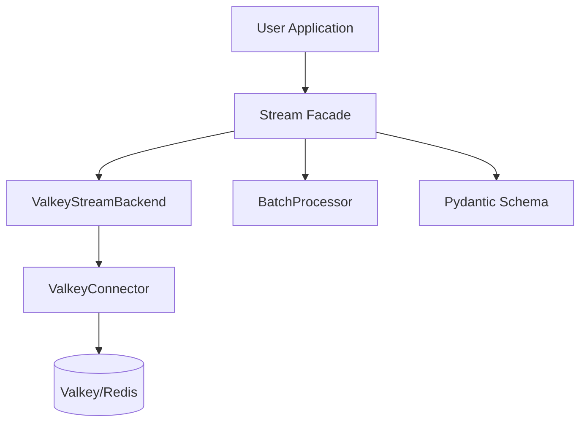

# Architecture

The **Python Stream Processing Framework (PSPF)** uses a **Composition-based** architecture to provide flexibility, testability, and enterprise-grade reliability.

## Core Components

The system is built around three main components that are injected into the high-level `Stream` facade.

### 1. Stream Facade
The `Stream` class acts as the entry point. It coordinates the other components but does not contain low-level logic itself. It handles:
- **Dependency Injection**: Takes a configured Backend and Schema.
- **Context Management**: `async with` support for resource cleanup.
- **Tracing**: Automatically injects OpenTelemetry contexts.

### 2. ValkeyBackend
Handles all interactions with the Valkey (or Redis) server.
- **Connector**: Manages the connection pool.
- **Stream Operations**: `XADD`, `XREADGROUP`, `XACK`.
- **Reliability**: Implements `XAUTOCLAIM` (Worker Recovery) and Dead Letter logic.

### 3. BatchProcessor
The engine that drives the consumption loop.
- **Batching**: Reads messages in chunks for efficiency.
- **Signal Handling**: Gracefully shuts down on `SIGTERM`.
- **Observability**: Updates Prometheus metrics and starts Tracing spans.

### 4. Schema (Pydantic)
Ensures data integrity.
- **Validation**: All incoming/outgoing data is validated against a Pydantic model.
- **Serialization**: Automatic JSON serialization.

## Data Flow

1. **Emit**: User calls `stream.emit(event)`. Data is validated, tracing context is injected, and it's written to Valkey.
2. **Consume**: `BatchProcessor` polls Valkey for a batch of messages.
3. **Process**: Each message is deserialized into a Pydantic object and passed to the user's `handler`.
4. **ACK**: If successful, the message is ACKed.
5. **Failure**: If processing fails, it is retried. If retries exceed the limit, it is moved to a Dead Letter Queue (DLQ).
