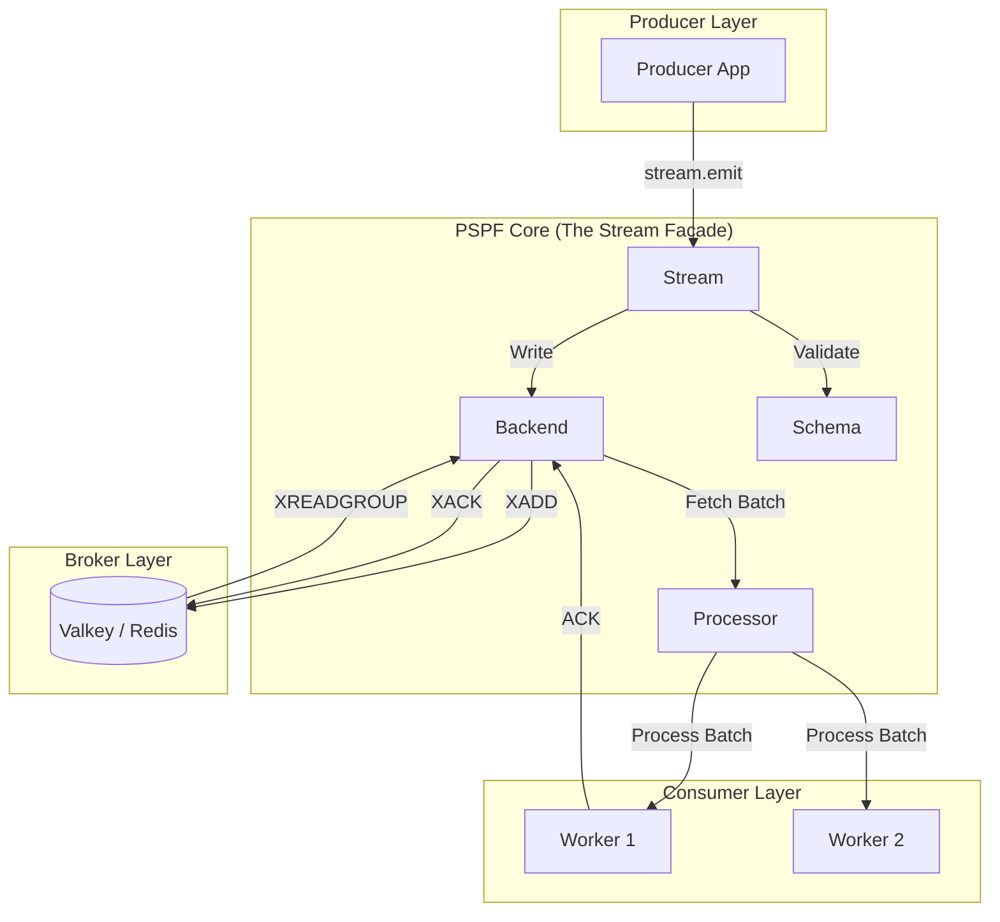

# PSPF Deep Dive: How It Works & Why It Matters

This guide provides a detailed look at the internal workings of the Python Stream Processing Framework (PSPF), its data flow, and how to operate it effectively.

## What is PSPF?

PSPF is a **lightweight, high-performance stream processing framework** for Python. It brings Kafka-like semantics (durability, replayability, consumer groups) to the Python ecosystem without the operational complexity of Kafka or the JVM.

### Why Use PSPF?
- **Zero Infrastructure Overhead**: Use Valkey (or Redis) as your broker. No Zookeeper, no JVM heap tuning.
- **Exactly-Once Processing**: Built-in mechanisms to ensure a message is processed exactly once, even if a worker crashes.
- **Developer First**: Native Python, Pydantic for schemas, and `asyncio` for high-concurrency.
- **Enterprise Grade**: Built-in metrics, health checks, and administration APIs for production monitoring.

---

## 🏗️ Architectural Overview

PSPF is built on a **Modular, Composition-based Architecture**. This means every part of the system is replaceable and testable.



### Key Components:
1.  **Stream (Facade)**: The "brain" of the operation. It coordinates schemas, backends, and processors. Use it for both producing and consuming.
2.  **Backend (Storage)**: Handles the raw interaction with the broker. The `ValkeyStreamBackend` is the gold standard for production.
3.  **Processor (Engine)**: The loop that pulls data, handles signals (graceful shutdown), and manages batching.
4.  **Schema (Pydantic)**: Defines what your data looks like. If it doesn't match the schema, it doesn't enter the stream.

---

## 🌊 Data Flow Journey

How does a single event travel through PSPF?

### 1. The Production phase
1.  **Emit**: Your application calls `await stream.emit(MyEvent(...))`.
2.  **Validation**: PSPF validates the event against your Pydantic model.
3.  **Context Injection**: Tracing IDs (OpenTelemetry) are automatically injected into the event metadata.
4.  **Serialization**: The event is serialized to JSON.
5.  **Persistence**: The event is appended to the Valkey stream (`XADD`).

### 2. The Consumption phase
1.  **Polling**: The `BatchProcessor` polls the backend for new messages.
2.  **Claiming**: In a distributed setup, PSPF uses `XAUTOCLAIM` to pick up messages from workers that may have crashed.
3.  **Processing**: The `handler` function you wrote is called with a batch of validated events.
4.  **Acknowledgment**: If your handler completes without error, PSPF sends an `XACK` to Valkey.
5.  **DLQ (Dead Letter Queue)**: If processing fails repeatedly, the message is automatically moved to a "Dead Letter" stream for manual inspection.

---

## 🚀 Simplest Example Possible

Here is the absolute minimum you need to get a worker running.

```python
import asyncio
from pspf import Stream, BaseEvent

# 1. Define your data
class GreetingEvent(BaseEvent):
    message: str

# 2. Define your logic
async def handle_greeting(event: GreetingEvent):
    print(f"Received Greeting: {event.message}")

# 3. Connect it all together
async def main():
    # Auto-instantiates Valkey (fallback to Memory if Valkey is unavailable)
    stream = Stream(topic="greetings_stream", group="group1", schema=GreetingEvent)

    @stream.subscribe("greetings_stream")
    async def handle_greeting(event: GreetingEvent):
        print(f"Received Greeting: {event.message}")

    async with stream:
        # Emit a message
        await stream.emit(GreetingEvent(message="Hello World!"))
        
        # Start consuming
        await stream.run_forever()

if __name__ == "__main__":
    asyncio.run(main())
```

---

## 🛠️ Monitoring & Management

PSPF is designed to be "visible" in production.

### Real-time Monitoring (Prometheus)
Every worker exposes an HTTP endpoint (default `8000`) that Prometheus can scrape.
- **`stream_lag`**: The most important metric. Tells you how far behind your consumers are.
- **`stream_messages_processed_total`**: Throughput and error rates.
- **`stream_processing_seconds`**: Latency—how long is your code taking to run?

### Dynamic Control (Admin API) & CLI
The Admin API (default `8001`) allows you to manage workers.
- **DLQ Management**: Inspect and purge your dead letter queues via the `pspfctl dlq-inspect <stream>` and `pspfctl dlq-purge <stream>` CLI commands.
- **Health Checks**: Standard `GET /health` for Kubernetes/Docker health checks.

### Visualizing with Grafana
Use the pre-built PSPF dashboard to see throughput, lag, and latency in one place.


*(Note: Replace with actual local path or screenshot if available in production docs)*

---

## 🏁 Summary: Why PSPF?
PSPF bridge the gap between "simple but unreliable" (RabbitMQ without acks, Redis Pub/Sub) and "powerful but complex" (Kafka). It gives you the **reliability** of an enterprise stream processor with the **simplicity** of a Python library.

With support for both **SQLite** and **RocksDB** for state management, it's ready for everything from edge devices to high-throughput data pipelines.
